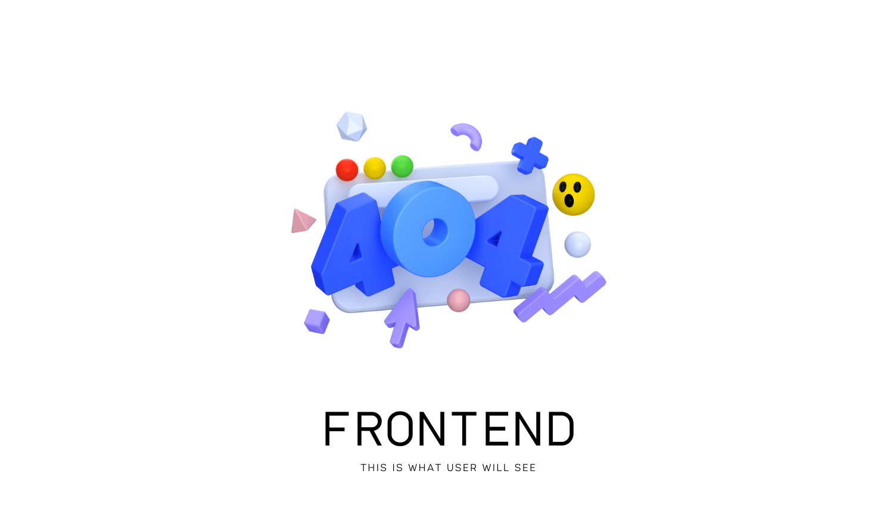

# Frontend

This is repository for frontend for RecoFach application.



## Project setup

To install and run this repo locally for development
perform following steps:

1. Clone the repository.
1. `cd` into needed folder.
1. Install dependecies

    ```bash
    yarn install
    ```

1. Create `.env` file and define following in it:
    - `API_URL` - Url of your backend endpoint
    - `API_PORT` - Port of your backend endpoint
1. Done.

## Production

Follow these steps to create production-ready build. You will need [docker](https://docker.com) have installed.

1. Build the docker image. You need do pass *enviroment variables*
   to specify location of backend service. Ensure to replace
   `api_url` and `api_port` values with yours.

    ```docker
    docker build \
    --build-arg api_url="http://localhost" \
    --build-arg api_port="8080" \
    -t recofach-frontend .
    ```

1. Run the docker image. Ensure map `3000` port to needed one.

    ```docker
    docker run -p 3000:3000 \
    --name recofach-frontend recofach-frontend
    ```

### Compiles and hot-reloads for development

To run development server - use following command:

```bash
yarn serve
```

### Compiles and minifies for production

To run optimizations and minifications for *production build*
simply use:

```bash
yarn build
```

If you want **more** optimization run:

```bash
yarn bmodern
```

It will create two bundles:

1. Modern bundle targeting modern browsers that support
   [ES modules](https://jakearchibald.com/2017/es-modules-in-browsers/)
1. and legacy bundle targeting older browsers that do not

For more details see [documentation](https://cli.vuejs.org/guide/browser-compatibility.html#modern-mode)

### Lints and fixes files

We use Airbnb config to keep our code clean, fast,
readable and usable. Use following command to check if
new code have code-style issues **before** push.

```bash
yarn lint
```

### Customize configuration

See [Configuration Reference](https://cli.vuejs.org/config/).
